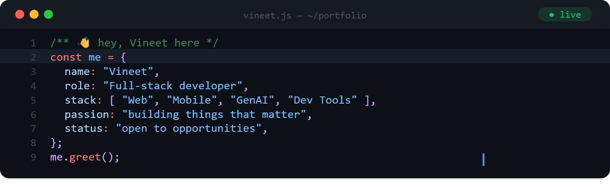

<h1>Hey, I'm Vineet Pandey 👋

  

---

## 🙋‍♂️ About Me

---

## 🛠️ Tech Stack
 
### 🎨 Frontend

  
  
  
  
  
  
  

 
### 📱 Mobile

  
  
  

 
### ⚙️ Backend & Runtime

  
  
  
  
  

 
### 🗄️ Database & Auth

  
  
  

 
### 🧠 AI & LLMs

  
  

 
### 📦 State Management & Tools

  
  
  

 
---

## 🚀 Projects

### 🌐 Web

| Project | Description | Stack | Link |
|--------|-------------|-------|------|
| **[Context Sync](https://github.com/Vineetpandey0/context-sync)** | Chrome extension that preserves AI conversations as reusable structured context — solving LLM context loss and enabling multi-session workflows. | `JS` `Chrome Ext` `Manifest V3` | — |
| **[AdStudio](https://github.com/Vineetpandey0/AdStudio)** | AI-powered ad generator that creates scripts, visuals, and voiceovers — reducing manual ad creation time by ~80% | `React` `Next.js` `Tailwind` `Node.js` `Hugging Face API` | [🔗 Live](https://adstudioai.vercel.app/) |
| **[Sparkl](https://github.com/Vineetpandey0/Sparkl)** | Photo sharing social platform with real-time feed, authentication & image uploads | `Next.js` `MongoDB` `TypeScript` `Zustand` | [🔗 Live](https://sparkl-share.vercel.app/) |

### 📱 Mobile

| Project | Description | Stack |
|--------|-------------|-------|
| **[VoterAware](https://github.com/Vineetpandey0/VoterAware)** | Cross-platform app for election updates, polling locations & real-time voter resources | `React Native` `Expo` |

---

## 🏆 Achievements

| 🚀 Hackathon Expert | 🏅 SDI 2025 Finalist |
|:---:|:---:|
| **12+ Hackathons** | **National Hackathon** |
| *3× Finalist* | *Smart Delhi Ideathon* |

---

## 📊 GitHub Stats

  

  

---

## 💼 Open to Opportunities

Actively seeking **Summer 2026 Internship roles** in:

• Software Engineering  
• Full Stack Development  
• AI / GenAI Engineering  

📌 Strong in: `React` `Next.js` `Node.js` `C++ (DSA)` `Software Engineering` `Full Stack Development`

📩 Reach out: vineetpandey0090@gmail.com

---

 

 
  

*"Building scalable solutions at the intersection of user experience and artificial intelligence."*

 

<svg width="100%" height="100" viewBox="0 0 900 100" xmlns="http://www.w3.org/2000/svg">
  <defs>
    <linearGradient id="footerBg" x1="0%" y1="0%" x2="100%" y2="100%">
      <stop offset="0%" style="stop-color:#0f0c29"/>
      <stop offset="50%" style="stop-color:#302b63"/>
      <stop offset="100%" style="stop-color:#24243e"/>
    </linearGradient>
  </defs>
  <path d="M0,0 Q225,40 450,20 T900,0 L900,100 L0,100 Z" fill="url(#footerBg)"/>
  <path d="M0,10 Q225,50 450,30 T900,10 L900,100 L0,100 Z" fill="#6366f1" fill-opacity="0.2"/>
</svg>

